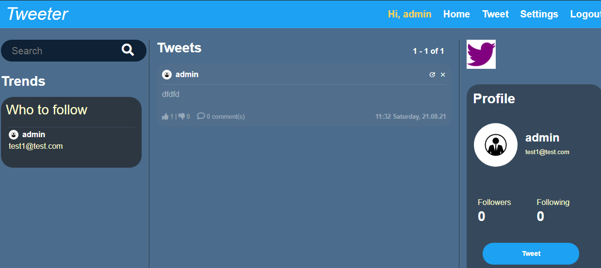

# Tweeter app

An example of web application using Django like twitter

Demo Image:


## Setup

1. Unzip the folder Tweeter.

2. Move to the base directory: ```cd Tweeter```

3. Create a new python enveronment with: ```python -m venv env```.

4. Activate enveronment with: ```env\Scripts\activate``` on windows, or ```source env/bin/activate``` on Mac and Linux.

5. Install required dependences with: ```pip install -r requirements.txt```.

6. DATABASE configuration
   If use My SQL as backend DB:
    - Create a fresh database at database server
    - Select DATABASES in settings.py (comment out the one for SQL Server)
    - Notes: in DATABASES setting, use the account with permission (CRUD), then manage.py migrate can works


   If use SQL Server as backend DB:
    - Create a fresh database at database server
    - Select DATABASES in settings.py (comment out the one for My SQL )
    - Notes: in DATABASES setting, use the account with permission (CRUD), then manage.py migrate can works


7. Make migrations with: ```python manage.py makemigrations``` and then ```python manage.py migrate```.

8. Run app localy with: ```python manage.py runserver```.

