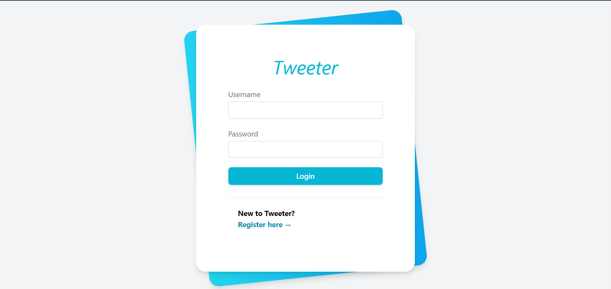

# Tweeter Social Application

- An mini social application that allow user to sharing their posts with other people.
- The user can:
    - `register` and `login` in the system (already available with current skeleton)
    - `search` other users by First Name, Last Name or Username.
    - `follow` specific user.
    - `view` his/her `own posts` as well as the `posts of following` in a timeline view.
    - `view` his/her `following` and `followers`.

### Your Tasks
- Use the Django skeleton `Tweeter` to build up the Application.
- You are free to add any properties/features you want into the application.
- The submission `MUST be runable`, there should be a `README.md` to guide on how to run the application on local environment.
