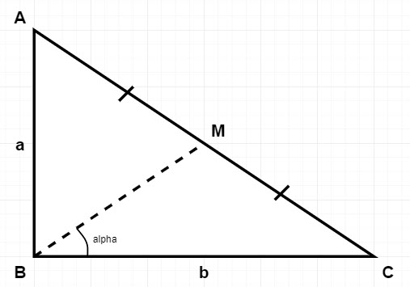

## Lab 1: Leap Year Identification
We have a Leap Day on 29<sup>th</sup> February every 4 years.
In the Gregorian calendar, three criteria will be taken into account to identify leap years.
- The year can be evenly divided by 4, is a leap year, unless:
    - The year can be evenly divided by 100, it is `NOT` a leap year, unless:
        - The year is also evenly divisible by 400. Then it is a leap year.
### Task
- You are given the year, and you have to write a function to check if the year is leap or not.
- Note that you have to complete the function and remaining code is given as template.
### Input Format
- Read `y`, the year that need to be checked.
### Constraint
- 1900 &leq; `y` &leq; 10<sup>5</sup>
###  Output Format
- Your function must return a `boolean value` (`True`/`False`)
## Lab 2: Triangle Angle Calculation


`ABC` is the `Right triangle`. With ABC = 90°

Point `M` is the midpoint of hypotenuse.
### Task
- You are given the lengths `AB` and `BC`.
- Your task is to find  angle `alpha` in `degrees`.
### Input Format
- The first line contains the length of side `AB`.
- The second line contains the length of side `BC`.
### Constraints
- 0 &lt; `AB` &leq; 100
- 0 &lt; `BC` &leq; 100
- Lengths  and  are natural numbers.
### Output Format
- Output `MBC` in degrees.
- `Note: Round the angle to the nearest integer`.
- Examples:
    - If angle is 10.5001°, then output 11°.
    - If angle is 10.5000°, then output 11°.
    - If angle is 10.4999°, then output 10°.
- Sample Input:
```python
  10
  10
```
- Sample Output:
```python
  45
```
## Lab 3: Champion and Runner-up
Given the participants' score sheet for your Company Sports Day, you are requested to find:
- The champion score.
- The runner-up score.
### Input Format
- The line contains an array `score[]` of `n` integers each separated by a `space`.
### Constraints
- 2 &lt; `n` &leq; 10
- -100 &lt; `score[i]` &leq; 100
### Output Format
Print the champion & runner-up score
### Sample Input
```text
15 67 12 86 75
```
### Sample Output
```text
[86, 75]
``` 
## Lab 4: Find Student Average Marks
We have a data of `N` students. Each record contains the student's name, and their percent marks in `Maths`, `Physics` 
and `Chemistry`. The marks can be `floating` values.

The user enters some integer `N` followed by the names and marks for `N` students. The user then enters a student's 
name.

Output the `average percentage marks` obtained by that student, **correct to two decimal places**.
### Input Format
- The first line contains the integer `N`, the number of students.
- The next `N` lines contains the `name` and `marks` obtained by that student separated by a `space`. 
- The final line contains the `name` of a particular student previously listed.
### Constraints
- 2 &lt; `N` &leq; 10
- 0 &lt; `marks` &leq; 100
### Output Format
- The average of the marks obtained by the particular student correct to `2 decimal places`.
### Sample Input
```text
4
Rocky 56.5 70 80
Harry 91 32 76
Emily 87 76.5 82
Hana 79 54 90.5
Emily
```
### Sample Output
```text
81.83
```

### Unit-Testing Support
There is a supported unit-test set for these labs. We need to use `pytest` to run it. To install it, run this command:
```commandline
pip install -U pytest
```
To run the test for a specific lab:
```commandline
pytest -v -k TestLab1

pytest -v -k TestLab2

pytest -v -k TestLab3

pytest -v -k TestLab4
```

**Happy Practicing!**

[**Back to Module List**](../README.md)