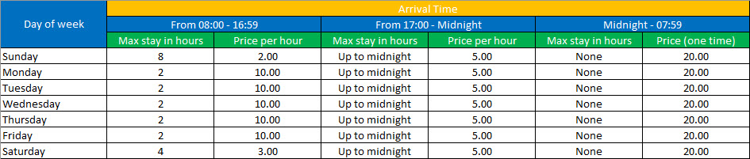

# Console parking payment system

- A car parking system allows customers to select the number of hours to leave their car in the car park.
- Customer will be asked to choose options to `park` (in) or `pickup` (out) or `history`.
- With `park` option:
    - Customer will need to input:
        - The `arrival time`: The time to start parking. For ex: `2020-06-18 18:30`.
        - The `car identity`: The identity of the car in a valid format like this `59C-12345`, `01E-00001`.
        - The `frequent parking number`(optional): This number consists of 4 digits and a check digit that is calculated
        using **_modulo 11 check digit calculation_**.(Ex: `12343` is a valid frequent parking number)
    - System will collect the information and store them in file(s), and return to the option selection. 
- With `pickup` option: 
    - The customer will need to input the `car identity`.
    - System will calculate and display the parking price, round up to 2 decimal format(Ex: `50.46`).
    - If not valid identity found, then system will raise the error.
    - Customer will pay the fee by input a payment amount, it need to be great or equal the fee. The exceed amount
    will be kept for next payment (stored in file(s)).
- With `history` option:
    - The customer will need to input the `car identity`.
    - The system will export a file with name `<car_identity>.txt`:
        - Total payments.
        - Available credits (remaining credits when customer overpay their bills).
        - Parked dates in format `parked datetime - stay time`.
    - Example file output:
        ```text
        Total payment: 154.46
        Available credits: 0.00
        Parked Dates:
        2020-06-18 18:30 - 10:30
        2020-06-19 08:30 - 02:45
        ``` 
        
- The price of parking regulation is displayed in the bellow table:

- The discount of `50%` is available from `17:00 - Midnight`, `10%` for `other arrival time`.
- Any car parked exceed `max stay hours` will pay `double price` for each exceed hour it parked. 

### Your Tasks
- Calculate the price for parking.
- Apply all the concepts we have learned:
    - Class and Function, OOP concepts.
    - Exception Handling.
    - Datetime module.
    - Python common data structures (turple, dictionary, string, decimal, ...)
    - Using files to store the data we need.
